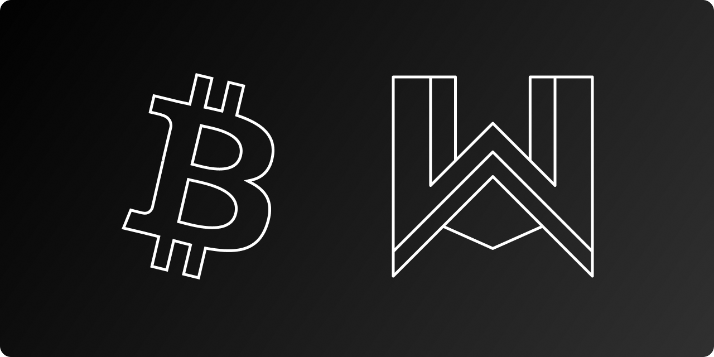
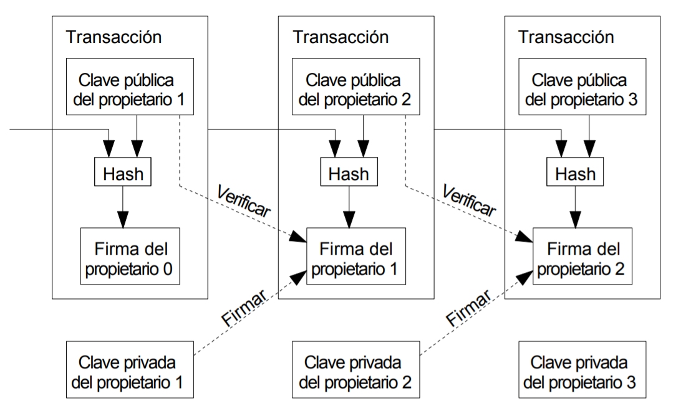

# 🚀Web3 Aprende

  

 

# 📄 Contenido

- [Introducción a Blockchain](#Introducción-a-Blockchain)
- [¿Qué es blockchain?](#¿Qué-es-blockchain?)
- [Lecturas recomendadas](#Lecturas-recomendadas)

# Introducción a Blockchain
Antes de iniciar a aprender de blockchain te recomendas tener mínimos conocimientos de Bitcoin, descentralización, criptografía y qué es una base de datos. Si tienes preguntas no dudes en preguntar en la comunidad de Web3 Aprende 👇 
&ensp;

# ¿Qué es blockchain? 
Una blockchain o en español cadena de bloques es una base de datos distribuida que se comparte entre los nodos de una red informática. Como una base de datos, blockchain almacena información electrónicamente en formato digital. Las cadenas de bloques son más conocidas por su papel crucial en los sistemas de criptomonedas, como Bitcoin, para mantener un registro seguro y descentralizado de las transacciones. La innovación de una cadena de bloques es que garantiza la fidelidad y seguridad de un registro de datos y genera confianza sin necesidad de un tercero. 
Una diferencia clave entre una base de datos típica y una blockchain es cómo se estructuran los datos. Una cadena de bloques reúne la información en grupos, conocidos como bloques, que contienen conjuntos de información. Los bloques tienen cierta capacidad de almacenamiento y, cuando se llenan, se cierran y se vinculan al bloque previamente llenado, formando una cadena de datos conocida como blockchain. Toda la información nueva que sigue a ese bloque recién añadido se compila en un bloque recién formado que, una vez lleno, también se añadirá a la cadena. 
Una base de datos suele estructurar sus datos en tablas, mientras que una cadena de bloques, como su nombre indica, estructura sus datos en trozos (bloques) que se encadenan. Esta estructura de datos hace inherentemente una línea de tiempo irreversible de los datos cuando se implementa en una naturaleza descentralizada. Cuando un bloque se llena, queda grabado en piedra y pasa a formar parte de esta línea temporal irreversible. Cada bloque de la cadena recibe una marca de tiempo exacta cuando se añade a la cadena. 

## Resumen
- La cadena de bloques es un tipo de base de datos compartida que difiere de una base de datos típica en la forma en que almacena la información;blockchain almacena los datos en bloques que luego se vinculan entre sí mediante criptografía. 
- A medida que llegan nuevos datos, se introducen en un nuevo bloque. Una vez que el bloque se llena de datos, se encadena con el bloque anterior, lo que hace que los datos se encadenen en orden cronológico. 
- En una cadena de bloques se pueden almacenar diferentes tipos de información, pero el uso más común hasta ahora ha sido el de libro de contabilidad para las transacciones. 
- En el caso de Bitcoin, el blockchain se utiliza de forma descentralizada, de modo que ninguna persona o grupo tiene el control, sino que todos los usuarios lo mantienen de forma colectiva. 
- Las cadenas de bloques descentralizadas son inmutables, lo que significa que los datos introducidos son irreversibles. En el caso de Bitcoin, esto significa que las transacciones se registran permanentemente y pueden ser vistas por cualquiera. 

  

 

# ¿Cómo funciona Blockchain? 
El objetivo de la cadena de bloques es permitir que la información digital se registre y distribuya, pero no se edite, es decir, la información una vez registrada en la blockchain es inmutable. De este modo, la información no puede ser modificada, eliminada y una vez que un bloque es finalizado tampoco se le puede agregar más información.  

Blockchain fue propuesto por primera vez como proyecto de investigación en 1991. El concepto de blockchain es anterior a su primer aplicación generalizada en uso: Bitcoin, en junio del 2009. 

En recientes años el uso de blockchain se ha disparado con la creación de diferentes criptomonedas, finanzas descentralizadas (DeFi), tokens no fungibles (NFT) y contratos inteligentes (Smart Contracts). 

Para validar nuevas entradas o registros en un bloque, es necesario que la mayoría de la potencia de cálculo de la red descentrlaizda esté de ac uerdo. Para evitar que malos actores validen transacciones eerróneas o dobles gastos, las cadenas de bloques están aseguradas por un mecanismo de consenso como la prueba de trabajo (PoW: Proof of Work) o la prueba de participación o consenso (PoS: Proof of Stake). Estos mecanismos permiten el acuerdo incluso cuando no hay un solo nodo a cargo. 

Vamos a verlo con un ejemplo: 
Imagina que una empresa posee una granja de servidores(nodos) con 10.000 ordenadores utilizados para mantener una base de datos que contiene toda la información de las cuentas de sus clientes. Esta empresa es propietaria de un edificio que contiene todos estos ordenadores bajo un mismo techo y tiene el control total de cada uno de estos ordenadores y de toda la información que contienen. Sin embargo, esto supone un único punto de fallo. ¿Qué pasa si se corta la electricidad en ese lugar? ¿Y si se corta la conexión a Internet? ¿Y si se incendia? ¿Y si un mal actor borra todo con una sola pulsación? En cualquier caso, los datos se pierden o se corrompen. 
Lo que hace una cadena de bloques es permitir que los datos contenidos en esta base de datos se repartan entre varios nodos de la red en distintas ubicaciones. Esto no sólo crea redundancia, sino que también mantiene la fidelidad de los datos almacenados en ella: si alguien intenta alterar un registro en una instancia de la base de datos, los demás nodos no se verían alterados y, por tanto, se evitaría que un mal actor lo hiciera. Si un usuario manipula el registro de transacciones de Bitcoin, todos los demás nodos se cotejarían entre sí y localizarían fácilmente el nodo con la información incorrecta. Este sistema ayuda a establecer un orden exacto y transparente de los acontecimientos. De este modo, ningún nodo de la red puede alterar la información que contiene. 
Por ello, la información y el historial (como el de las transacciones de una criptomoneda) son irreversibles. Este registro podría ser una lista de transacciones (como con una criptodivisa), pero también es posible que una blockchain contenga otra variedad de información, como contratos legales, identificaciones estatales o el inventario de productos de una empresa. 

## Transparencia 
Debido a la naturaleza descentralizada de la blockchain de Bitcoin, todas las transacciones pueden verse públicamente, ya sea teniendo un nodo personal o utilizando exploradores de la cadena de bloques que permiten a cualquiera ver las transacciones que se producen en directo. Cada nodo tiene su propia copia de la cadena que se actualiza a medida que se confirman y añaden nuevos bloques. Esto significa que, si se quiere, se puede seguir el rastro de Bitcoin allá donde vaya.
Por ejemplo, los intercambios han sido hackeados en el pasado, donde aquellos que guardaban Bitcoin en el intercambio lo perdieron todo. Mientras que el hacker puede ser totalmente anónimo, los Bitcoins que extrajeron son fácilmente rastreables. Si los Bitcoins robados en algunos de estos hackeos fueran trasladados o gastados en algún lugar, se sabría. 
Por supuesto, los registros almacenados en la cadena de bloques de Bitcoin (al igual que la mayoría de los demás) están cifrados. Esto significa que sólo el propietario de un registro puede descifrarlo para revelar su identidad (utilizando un par de claves públicas y privadas). Como resultado, los usuarios de las cadenas de bloques pueden permanecer en el anonimato a la vez que preservan la transparencia. 

## ¿Es blockchain seguro? 
La tecnología Blockchain logra la seguridad y la confianza descentralizada de varias maneras. Para empezar, los nuevos bloques se almacenan siempre de forma lineal y cronológica. Es decir, siempre se añaden al "final" de la cadena de bloques. Una vez que un bloque se ha añadido al final de la blockchain, es extremadamente difícil volver atrás y alterar el contenido del bloque a menos que la mayoría de la red haya alcanzado un consenso para hacerlo. Esto se debe a que cada bloque contiene su propio hash, junto con el hash del bloque anterior, así como la marca de tiempo mencionada anteriormente. Los códigos hash se crean mediante una función matemática que convierte la información digital en una cadena de números y letras. Si esa información se edita de alguna manera, el código hash también cambia. 
Supongamos que un hacker, que también dirige un nodo en una red de blockchain, quiere alterar la cadena de bloques y robar criptomonedas a todos los demás. Si alterara su propia copia, ésta ya no se alinearía con la de los demás. Cuando todos los demás comparen sus copias entre sí, verán que esta copia sobresale, y la versión de la cadena de ese hacker será desechada como ilegítima. 
Para tener éxito con un ataque de este tipo sería necesario que el hacker controlara y alterara simultáneamente el 51% o más de las copias de la cadena de bloques para que su nueva copia se convirtiera en la copia mayoritaria y, por tanto, en la cadena acordada. Un ataque de este tipo también requeriría una inmensa cantidad de dinero y recursos, ya que tendrían que rehacer todos los bloques porque ahora tendrían marcas de tiempo y códigos hash diferentes. 
Debido al tamaño de muchas redes de criptomonedas y a la rapidez con la que crecen, el coste de llevar a cabo tal hazaña sería probablemente insuperable. No sólo sería extremadamente caro, sino también probablemente infructuoso. Hacer algo así no pasaría desapercibido, ya que los miembros de la red verían tales alteraciones drásticas en la cadena de bloques. Los miembros de la red harían entonces un hard fork a una nueva versión de la cadena que no haya sido afectada. Esto haría que el valor de la versión atacada del token cayera en picado, haciendo que el ataque fuera en última instancia inútil, ya que el mal actor tiene el control de un activo sin valor. Lo mismo ocurriría si el actor malo atacara la nueva bifurcación de Bitcoin. Está construido de esta manera para que participar en la red esté mucho más incentivado económicamente que atacarla. 

  

 

## ¿Cómo se utilizan las cadenas de bloques?  
Como ya sabemos, los bloques de la cadena de bloques de Bitcoin almacenan datos sobre transacciones monetarias. Hoy en día, hay más de 10.000 sistemas de criptomonedas que funcionan con blockchain. Pero resulta que blockchain es en realidad una forma fiable de almacenar datos sobre otros tipos de transacciones también. 
Algunas empresas que ya han incorporado blockchain son Walmart, Pfizer, AIG, Siemens, Unilever y muchas otras. Por ejemplo, IBM ha creado su blockchain Food Trust para rastrear el trayecto que recorren los productos alimentarios hasta llegar a su ubicación.  
¿Por qué hacer esto? La industria alimentaria ha sido testigo de innumerables brotes de E. coli, salmonela y listeria, así como de la introducción accidental de materiales peligrosos en los alimentos. En el pasado, se ha tardado semanas en encontrar el origen de estos brotes o la causa de la enfermedad de lo que la gente está comiendo. El uso de blockchain ofrece a las marcas la posibilidad de rastrear la ruta de un producto alimentario desde su origen, pasando por cada parada que realiza y, finalmente, su entrega. Si se descubre que un alimento está contaminado, se puede rastrear todo el camino a través de cada parada hasta su origen. No solo eso, sino que estas empresas también pueden ver ahora todo lo demás con lo que puede haber estado en contacto, lo que permite identificar el problema mucho antes y potencialmente salvar vidas. Este es un ejemplo de blockchain en la práctica, pero hay muchas otras formas de implementación de blockchain.  
### Banca y finanzas  
Tal vez ningún sector se beneficie más de la integración de blockchain en sus operaciones comerciales que la banca. Las instituciones financieras sólo operan en horario comercial, normalmente cinco días a la semana. Eso significa que si usted intenta depositar un cheque el viernes a las 6 de la tarde, probablemente tendrá que esperar hasta el lunes por la mañana para ver ese dinero en su cuenta. Incluso si hace el depósito durante el horario laboral, la transacción puede tardar de uno a tres días en verificarse debido al gran volumen de transacciones que los bancos tienen que liquidar. La cadena de bloques, en cambio, nunca duerme. 
Al integrar la cadena de bloques en los bancos, los consumidores pueden ver sus transacciones procesadas en tan sólo 10 minutos, básicamente el tiempo que se tarda en añadir un bloque a la cadena de bloques, independientemente de los días festivos o de la hora del día o de la semana. Con blockchain, los bancos también tienen la oportunidad de intercambiar fondos entre instituciones de forma más rápida y segura. En el negocio del comercio de acciones, por ejemplo, el proceso de liquidación y compensación puede tardar hasta tres días (o más, si se negocia a nivel internacional), lo que significa que el dinero y las acciones están congelados durante ese periodo de tiempo. 
Dada la magnitud de las sumas implicadas, incluso los pocos días que el dinero está en tránsito pueden acarrear costes y riesgos significativos para los bancos. El banco europeo Santander y sus socios de investigación sitúan el ahorro potencial entre 15.000 y 20.000 millones de dólares al año.4 Capgemini, una consultora francesa, estima igualmente que los consumidores podrían ahorrar hasta 16.000 millones de dólares en comisiones bancarias y de seguros cada año mediante aplicaciones basadas en blockchain. 
### Dinero 
La cadena de bloques es la base de criptomonedas como el Bitcoin. El dólar estadounidense está controlado por la Reserva Federal. Bajo este sistema de autoridad central, los datos y la moneda de un usuario están técnicamente al antojo de su banco o gobierno. Si el banco de un usuario es hackeado, la información privada del cliente está en riesgo. Si el banco del cliente se hunde o el cliente vive en un país con un gobierno inestable, el valor de su moneda puede estar en riesgo. En 2008, varios bancos en quiebra fueron rescatados, en parte con dinero de los contribuyentes. Estas son las preocupaciones por las que se concibió y desarrolló Bitcoin. 
Al distribuir sus operaciones a través de una red de ordenadores, blockchain permite que Bitcoin y otras criptodivisas funcionen sin necesidad de una autoridad central. Esto no sólo reduce el riesgo, sino que también elimina muchas de las tasas de procesamiento y transacción. También puede ofrecer a quienes se encuentran en países con monedas o infraestructuras financieras inestables una moneda más estable con más aplicaciones y una red más amplia de personas e instituciones con las que pueden hacer negocios, tanto a nivel nacional como internacional. 
El uso de carteras de criptodivisas para cuentas de ahorro o como medio de pago es especialmente profundo para quienes no tienen identificación estatal. Algunos países pueden estar desgarrados por la guerra o tener gobiernos que carecen de cualquier infraestructura real para proporcionar identificación. Los ciudadanos de estos países pueden no tener acceso a cuentas de ahorro o de corretaje y, por lo tanto, no tienen forma de almacenar su riqueza de forma segura. 
### Sanidad  
Los proveedores de servicios sanitarios pueden aprovechar la cadena de bloques para almacenar de forma segura los historiales médicos de sus pacientes. Cuando se genera un registro médico y se firma, puede escribirse en la cadena de bloques, lo que proporciona a los pacientes la prueba y la confianza de que el registro no puede ser modificado. Estos historiales médicos personales podrían codificarse y almacenarse en la blockchain con una clave privada, de modo que sólo sean accesibles para determinadas personas, garantizando así la privacidad. 
### Registros de propiedad  
Si alguna vez ha pasado por la oficina local del Registro Civil, sabrá que el proceso de registro de los derechos de propiedad es tan engorroso como ineficiente. Hoy en día, hay que entregar una escritura física a un empleado del gobierno en la oficina de registro local, donde se introduce manualmente en la base de datos central del condado y en el índice público. En el caso de una disputa sobre la propiedad, las reclamaciones sobre la misma deben conciliarse con el índice público. 
Este proceso no sólo es costoso y requiere mucho tiempo, sino que también es propenso a los errores humanos, y cada inexactitud hace que el seguimiento de la propiedad sea menos eficiente. Blockchain tiene el potencial de eliminar la necesidad de escanear documentos y de buscar archivos físicos en una oficina de registro local. Si la titularidad de la propiedad se almacena y verifica en la cadena de bloques, los propietarios pueden confiar en que su escritura es precisa y está registrada permanentemente.  
En países devastados por la guerra o en zonas que tienen poca o ninguna infraestructura gubernamental o financiera, y ciertamente ninguna oficina de registro, puede ser casi imposible demostrar la propiedad de un inmueble. Si un grupo de personas que vive en una zona así es capaz de aprovechar la cadena de bloques, se podrían establecer líneas de tiempo transparentes y claras de la propiedad.  

# Lecturas recomendadas
- https://www.investopedia.com/terms/b/blockchain.asp (Fuente - Source Investopedia)
- https://bitcoin.org/files/bitcoin-paper/bitcoin_es.pdf
- https://www.youtube.com/watch?v=hEoYL5j0wYU
- https://www.youtube.com/watch?v=V9Kr2SujqHw&t=140s
- https://www.ibm.com/es-es/topics/what-is-blockchain
- https://www.xataka.com/especiales/que-es-blockchain-la-explicacion-definitiva-para-la-tecnologia-mas-de-moda

### Inglés
- https://www.youtube.com/watch?v=_160oMzblY8
- https://www.youtube.com/watch?v=S9JGmA5_unY
- https://www.youtube.com/watch?v=Lx9zgZCMqXE
- https://michaelnielsen.org/ddi/how-the-bitcoin-protocol-actually-works/

 

## Forma parte de la comunidad
  &ensp;
  &ensp;
  
# Web3 Aprende Blockchain
